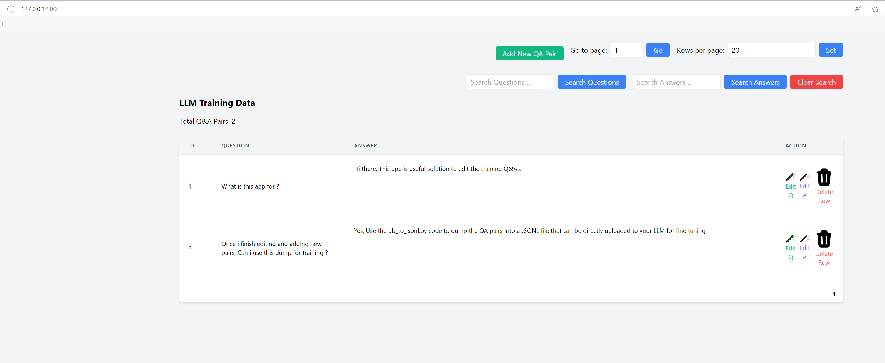

# LLMTrainingTools

LLMTrainingTools provides a suite of utilities designed to facilitate the creation and management of training data for language learning models (LLMs), particularly chatbots. It offers tools for converting data between JSONL and SQLite formats, editing training data through a web interface, and converting CSV files to JSONL.

# Key Features
### - **Flask UI for Data Editing**: A web application for easy editing of training data.
### - **CSV to JSONL Conversion**: Convert CSV files to JSONL format for LLM training.
### - **Export and Import Data**: Export data from the database to JSONL and import JSONL data into the database.
### - **Backup Data**: Backup the SQLite database to JSONL format for safekeeping or as SQL dump.


## Getting Started
 - Python 3.6 or above
 - Pip
 - An IDE (PyCharm preferred) VSCode also ok 
    
### Dependencies 
   - SQLite : For the Database operations
   - Flask : For the Web UI and API 
   - Flask SQLAlchemy & SQLAlchemy : For the SQLite DB operations
   - Jinja2 - For rendering the HTML templates

## Installation

Clone the repository and install the required Python packages:

***For Windows***
```bash 
git clone https://github.com/pradeepgudipati/LLMTrainingTools.git
cd LLMTrainingTools
python -m venv llmtraining
./llmtraining/Scripts/activate
pip install -r requirements.txt
```
***For Other platforms please adjust above commands***


# Usage

To run the web application for editing the training data
```bash
> python app.py

----------------------------------------------------------------
(llmtraining) PS D:\Dev\Workspace\LLMTrainingTools> python .\app.py                           
BASE_DIR: D:\Dev\Workspace\LLMTrainingTools
DB_PATH: D:\Dev\Workspace\LLMTrainingTools\jsonl_data_to_db/data/qa_data.db
 * Serving Flask app 'app'
 * Debug mode: on
WARNING: This is a development server. Do not use it in a production deployment. Use a production WSGI server instead.
 * Running on http://127.0.0.1:5000
Press CTRL+C to quit
 * Restarting with stat
BASE_DIR: D:\Dev\Workspace\LLMTrainingTools
DB_PATH: D:\Dev\Workspace\LLMTrainingTools\jsonl_data_to_db/data/qa_data.db
 * Debugger is active!
 * Debugger PIN: 209-879-976
127.0.0.1 - - [29/Feb/2024 12:11:15] "GET / HTTP/1.1" 200 -
...

```

Now Open the below URL in your favorite browser - http://127.0.0.1:5000



###  Now to export all these QA pairs in the Db into a JSONL file, run the following command
1. If you have a Question answer CSV base you can convert it to JSONL and then import it to the SQLite DB
2. Click on the "CSV to JSONL" button at the top. Once the conversion is done, you will see a message "CSV to JSONL Conversion Done"
3. Now Import the JSONL into the DB file (SQLite) by clicking on the "Import JSONL to DB" button. Once the import is done, you will see a message "Import JSONL to DB Done"
4. Now you can see the data in the table view. You can edit the data and save it back to the DB by clicking on the "Save to DB" button. Once the save is done, you will see a message "Data Saved to DB"
5. Now to export the data from the DB to JSONL, click on the "Export DB to JSONL" button. Once the export is done, you will see a message "Export DB to JSONL Done"
6. This JSONL file can now be used to train the LLM model. 

# Optional 

###  1. Convert the DB file to JSONL
1. Code for DB to JSONL is in [db_to_jsonl.py](jsonl_data_to_db%2Fdb_to_jsonl.py).
Verify the path for the jsonl and db files in the code

```python
# Paths for the JSONL file and SQLite database
jsonl_file_path = "data/qa_data.jsonl"
sqlite_db_path = "data/merged_data.db"
```
2. Now run the following command in the terminal to execute the code

```bash
python db_to_jsonl.py
```
###  2. Convert the JSONL file to DB

1. First verify the jsonl and db paths in the [jsonl_to_sqllite.py](jsonl_data_to_db%2Fjsonl_to_sqllite.py)

```python
jsonl_file_path = "src/data_tools/import_utils/data/qa_data.jsonl"
sqlite_db_path = "data/qa_data.db"
```
2. Run the following command in the terminal to execute the code
```bash 
python jsonl_to_sqllite.py
```

### 3. Convert the CSV file to JSONL

1. First verify the jsonl and csv paths in the[csv_to_jsonl.py](jsonl_data_to_db%2Fcsv_to_jsonl.py)
 - If you have multiple CSV files then use the below path variable 
```python
# Paths
csv_files_path = './docs'
output_jsonl_file = 'training_data.jsonl'
convert_folder_csv_to_jsonl(csv_files_path, output_jsonl_file)
``` 
 - If you have only 1 CSV file 
```python
# Paths
csv_files_path = './training_data.csv'
output_jsonl_file = 'training_data.jsonl'
convert_single_csv_to_jsonl(csv_file_path, output_jsonl_file)
```

2. Execute the code 
```bash 
python csv_to_jsonl.py
```

# More Details 

### 1. JSONL to DB - 

- JSONL to SQLite DB Converter Code -  [jsonl_to_sqllite.py](jsonl_data_to_db%2Fjsonl_to_sqllite.py)

This python code converts the jsonl data to a sqllite database with a table called messages. 
The messages table has 3 rows

1. id - Primary key
2. User - Contains the Question
3. Assistant - Contains the answer to the Question

### 2. DB to JSONL 
 - SQLite to JSONL Converter code - [db_to_jsonl.py](jsonl_data_to_db%2Fdb_to_jsonl.py)

This code converts the sqlite database to a jsonl file
The format of the jsonl is as follows

```json
{
  "messages": [
    {
      "role": "user",
      "content": ""
    },
    {
      "role": "assistant",
      "content": ""
    }
  ]
}
```

### 3. Flask Application for editing the training data

- Flask Server App Code - [app.py](src/app.py)
- Flask HTML Template - [table_view.html](templates%2Ftable_view.html)
- Data Model [llm_training_data_model.py](models%2Fllm_training_data_model.py)

### 4. Training files

1. JSONL Data File - [qa_data.jsonl](jsonl_data_to_db%2Fdata%2Fqa_data.jsonl)
2. SQLite DB file - [qa_data.db](jsonl_data_to_db%2Fdata%2Fqa_data.db)

### 5. CSV to JSONL File
- CSV to JSONL Converter -  [csv_to_jsonl.py](jsonl_data_to_db%2Fcsv_to_jsonl.py)

## Running the application 
Start the Flask server by running the below command in the terminal
```bash
 python app.py
```
Access the Web UI by opening the below URL in your favorite browser
http://localhost:5000


# Contributing
Contributions are welcome! If you have ideas for improvements or want to contribute code, please feel free to reach out or submit a pull request.

# License
This project is free to use and modify. For any queries or contributions, please contact Pradeep Gudipati on [Linkedin](https://www.linkedin.com/in/pradeepgudipati)
