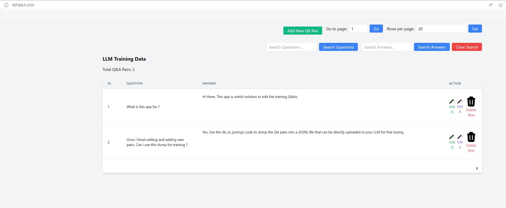

# LLMTrainingTools

A local data workbench for preparing chat fine-tuning datasets from CSV, SQLite, and JSONL.

LLMTrainingTools runs locally as a Flask app. It helps you import CSV/JSONL data, edit examples in a table, validate common dataset issues, back up the SQLite database, and export clean JSONL.



## Features

- Validation-first dataset QA for JSONL and CSV before import/export.
- Local Flask editor for CSV, SQLite, and JSONL training data.
- Core install stays lightweight: Flask, SQLite, SQLAlchemy, and dotenv only.
- Optional AI/vector dependencies live behind the `ai` extra.
- OpenAI/HF-style schema checks for chat messages, HF conversations, instruction/output rows, preference pairs, tool traces, RAG chunks, and eval records.
- Line-level detection for empty answers, duplicated questions, malformed roles, overlong examples, PII/secrets, encoding issues, invalid JSON, and bad CSV headers.
- Dataset shapes beyond Question/Answer: chat messages, preference pairs, tool traces, RAG chunks with metadata, and eval records with expected answers or rubrics.
- SQLite backup/restore, JSONL import/export, and CSV to JSONL conversion.

## Requirements

- Python 3.10 to 3.13
- [uv](https://docs.astral.sh/uv/)

## Quickstart

One command handles the local bootstrap and app startup:

```bash
git clone https://github.com/pradeepgudipati/LLMTrainingTools.git
cd LLMTrainingTools
./scripts/quickstart.sh
```

Open http://127.0.0.1:5000.

The script checks for `uv`, verifies `.env.example`, runs `uv sync`, and starts the app with the packaged CLI.

To install dependencies without starting the server:

```bash
./scripts/quickstart.sh --no-run
```

To inspect the bootstrap actions without changing files:

```bash
./scripts/quickstart.sh --dry-run
```

Manual equivalent:

```bash
git clone https://github.com/pradeepgudipati/LLMTrainingTools.git
cd LLMTrainingTools
uv sync
uv run llm-training-tools
```

The module entrypoint also works:

```bash
uv run python -m src.app
```

## Dependency Groups

Core app:

```bash
uv sync
```

AI/vector features:

```bash
uv sync --extra ai
```

Development checks:

```bash
uv sync --dev
./scripts/precommit.sh
uv run pytest
```

Dependencies are declared in `pyproject.toml` and locked in `uv.lock`.

## 60-Second Walkthrough

1. Start the app with `./scripts/quickstart.sh`.
2. Open http://127.0.0.1:5000.
3. Use the CSV to JSONL action with `samples/sample_qa.csv`.
4. Import the generated JSONL into SQLite.
5. Edit any row in the table.
6. Run validation before export.
7. Export JSONL for fine-tuning or evaluation.

Sample CSV:

```csv
Question,Answer
What is JSONL?,JSONL stores one JSON object per line.
When should I use a system message?,Use it to set durable behavior or context for the assistant.
```

Exported chat JSONL:

```json
{"messages":[{"role":"user","content":"What is JSONL?"},{"role":"assistant","content":"JSONL stores one JSON object per line."}]}
```

Additional examples are in `samples/sample_chat.jsonl`.

## Supported Dataset Shapes

Chat messages:

```json
{"messages":[{"role":"system","content":"Answer briefly."},{"role":"user","content":"What is JSONL?"},{"role":"assistant","content":"One JSON object per line."}]}
```

Preference pairs:

```json
{"prompt":"Pick the clearer answer.","chosen":"Use validation before export.","rejected":"Try uploading it."}
```

RAG chunks:

```json
{"text":"Fine-tuning examples should be specific and consistent.","metadata":{"source":"guide","chunk_id":"001"}}
```

Eval records:

```json
{"question":"Is the answer correct?","expected_answer":"Yes","rubric":"Must directly answer the question."}
```

## Validation

Use the upload dialog's **Validate** button before processing a CSV or JSONL file. The report shows valid example counts plus line-level errors and warnings, including malformed JSON, missing CSV headers, empty assistant answers, duplicated questions, invalid roles, overlong examples, likely PII, likely secrets, and non-UTF-8 files.

The same report is available through the local API:

```bash
curl -F "file=@samples/sample_chat.jsonl" http://127.0.0.1:5000/api/validate_dataset
```

## Configuration

Runtime configuration is loaded from `.env.example` by default. For private local overrides, set environment variables directly or create an ignored `.env` file.

Important settings:

```bash
FLASK_SECRET_KEY=replace-with-a-random-secret
FLASK_RUN_HOST=127.0.0.1
FLASK_RUN_PORT=5000
LLMTOOLS_DB_PATH=src/data/qa_data.db
```

AI features require optional dependencies and API keys:

```bash
uv sync --extra ai
OPENAI_API_KEY=...
```

## Docker Compose

```bash
docker compose up --build
```

Open http://127.0.0.1:5000.

## CI

GitHub Actions installs dependencies with uv, runs `./scripts/precommit.sh`, and runs pytest on Python 3.10, 3.11, and 3.12.

## License

MIT. See `LICENSE`.
