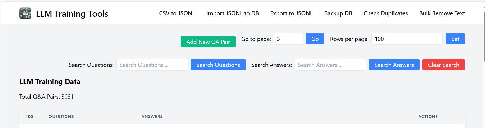

# LLMTrainingTools

LLMTrainingTools provides a suite of utilities designed to facilitate the creation and management of training data for language learning models (LLMs), particularly chatbots. It offers tools for converting data between JSONL and SQLite formats, editing training data through a web interface, and converting CSV files to JSONL.

# Features
### - **JSONL and SQLite Conversion**: Convert data between JSONL files and SQLite databases.
### - **Flask UI for Data Editing**: A web application for easy editing of training data.
### - **CSV to JSONL Conversion**: Convert CSV files to JSONL format for LLM training.


## Getting Started
 - Python 3.6 or above
 - Pip
 - An IDE (PyCharm preferred) VSCode also ok
 - SQLite

## Installation

Clone the repository and install the required Python packages:
```bash 
git clone https://github.com/pradeepgudipati/LLMTrainingTools.git
cd LLMTrainingTools
pip install -r requirements.txt

```

# Usage

To run the web application for editing the training data
```bash
> python app.py

----------------------------------------------------------------
(llmtraining) PS D:\Dev\Workspace\LLMTrainingTools> python .\app.py                           
BASE_DIR: D:\Dev\Workspace\LLMTrainingTools
DB_PATH: D:\Dev\Workspace\LLMTrainingTools\jsonl_data_to_db/data/qa_data.db
 * Serving Flask app 'app'
 * Debug mode: on
WARNING: This is a development server. Do not use it in a production deployment. Use a production WSGI server instead.
 * Running on http://127.0.0.1:5000
Press CTRL+C to quit
 * Restarting with stat
BASE_DIR: D:\Dev\Workspace\LLMTrainingTools
DB_PATH: D:\Dev\Workspace\LLMTrainingTools\jsonl_data_to_db/data/qa_data.db
 * Debugger is active!
 * Debugger PIN: 209-879-976
127.0.0.1 - - [29/Feb/2024 12:11:15] "GET / HTTP/1.1" 200 -
...

```

Now Open the below URL in your favorite browser - http://127.0.0.1:5000



###  Now to export all these QA pairs in the Db into a JSONL file, run the following command

1. First verify the paths to the files : JSONL and DB  in the [db_to_jsonl.py](jsonl_data_to_db%2Fdb_to_jsonl.py)
```python
# Paths for the JSONL file and SQLite database
jsonl_file_path = "data/qa_data.jsonl"
sqlite_db_path = "data/merged_data.db"
```
2. Now run the following command in the terminal to execute the code

```bash
python db_to_jsonl.py
```
###  Now to convert the JSONL file to DB, run the following command

1. First verify the jsonl and db paths in the [jsonl_to_sqllite.py](jsonl_data_to_db%2Fjsonl_to_sqllite.py)

```python
jsonl_file_path = "data/qa_data.jsonl"
sqlite_db_path = "data/qa_data.db"
```
2. Now run the following command in the terminal to execute the code
```bash 
python jsonl_to_sqllite.py
```

###  Now to convert the CSV file to JSONL, run the following command

1. First verify the jsonl and csv paths in the[csv_to_jsonl.py](jsonl_data_to_db%2Fcsv_to_jsonl.py)
 - If you have multiple CSV files then use the below path variable 
```python
# Paths
csv_files_path = './docs'
output_jsonl_file = 'training_data.jsonl'
# Uncomment the line below to process all CSV files in a folder
convert_folder_csv_to_jsonl(csv_files_path, output_jsonl_file)
``` 
 - IF you have only 1 CSV file 
```python
# Paths
csv_files_path = './training_data.csv'
output_jsonl_file = 'training_data.jsonl'
convert_single_csv_to_jsonl(csv_file_path, output_jsonl_file)
```

2. Execute the code 
```bash 
python csv_to_jsonl.py
```

# More Details 

### 1. JSONL to DB - 

- JSONL to SQLite DB Converter Code -  [jsonl_to_sqllite.py](jsonl_data_to_db%2Fjsonl_to_sqllite.py)

This python code converts the jsonl data to a sqllite database with a table called messages. 
The messages table has 3 rows

1. id - Primary key
2. User - Contains the Question
3. Assistant - Contains the answer to the Question

### 2. DB to JSONL 
 - SQLite to JSONL Converter code - [db_to_jsonl.py](jsonl_data_to_db%2Fdb_to_jsonl.py)

This code converts the sqlite database to a jsonl file
The format of the jsonl is as follows

```json
{
  "messages": [
    {
      "role": "user",
      "content": ""
    },
    {
      "role": "assistant",
      "content": ""
    }
  ]
}
```

### 3. Flask Application for editing the training data

- Flask Server App Code - [app.py](app.py)
- Flask HTML Template - [table_view.html](templates%2Ftable_view.html)
- Data Model [llm_training_data_model.py](models%2Fllm_training_data_model.py)

### 4. Training files

1. JSONL Data File - [qa_data.jsonl](jsonl_data_to_db%2Fdata%2Fqa_data.jsonl)
2. SQLite DB file - [qa_data.db](jsonl_data_to_db%2Fdata%2Fqa_data.db)

### 5. CSV to JSONL File
- CSV to JSONL Converter -  [csv_to_jsonl.py](jsonl_data_to_db%2Fcsv_to_jsonl.py)

## Running the application 


# Contributing
Contributions are welcome! If you have ideas for improvements or want to contribute code, please feel free to reach out or submit a pull request.

# License
This project is free to use and modify. For any queries or contributions, please contact Pradeep Gudipati on [Linkedin](https://www.linkedin.com/in/pradeepgudipati)
